# Visual Analytics System for Steam Games Market Analysis

An interactive dashboard visual analytics system for market and marketing analysis on the Steam digital distribution games storefront

# Showcase

### Main dashboard

Composed of various coordinated visualizations to explore and analyze the Steam games market and marketing data

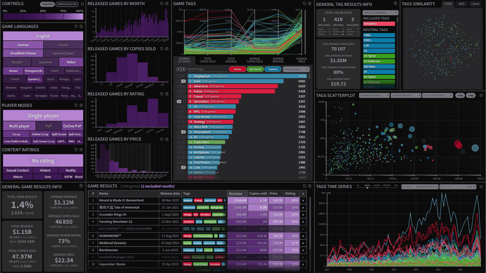

### Dashboard components and visualizations

Each visualization component can be expanded and used to explore different aspects of the Steam games market and marketing data

	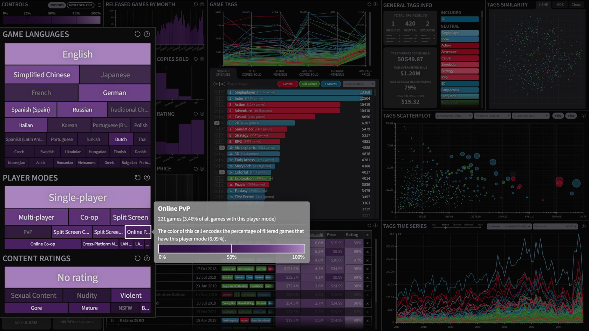
	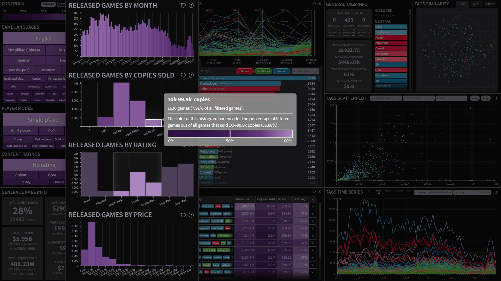
	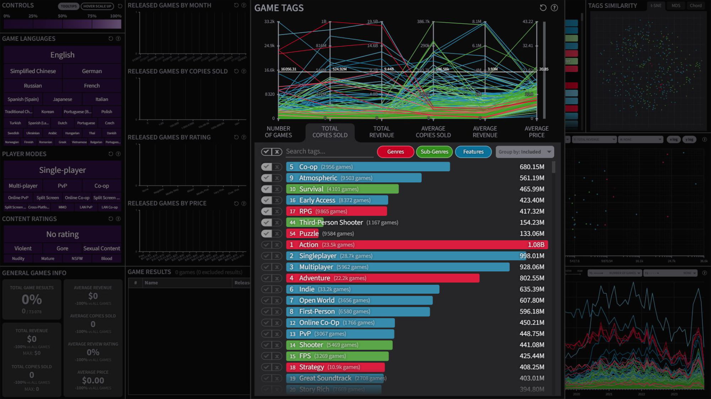
	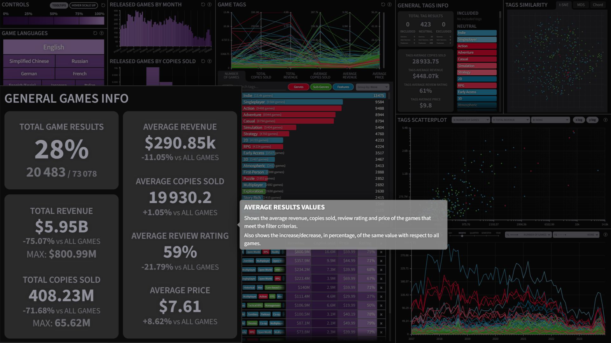
	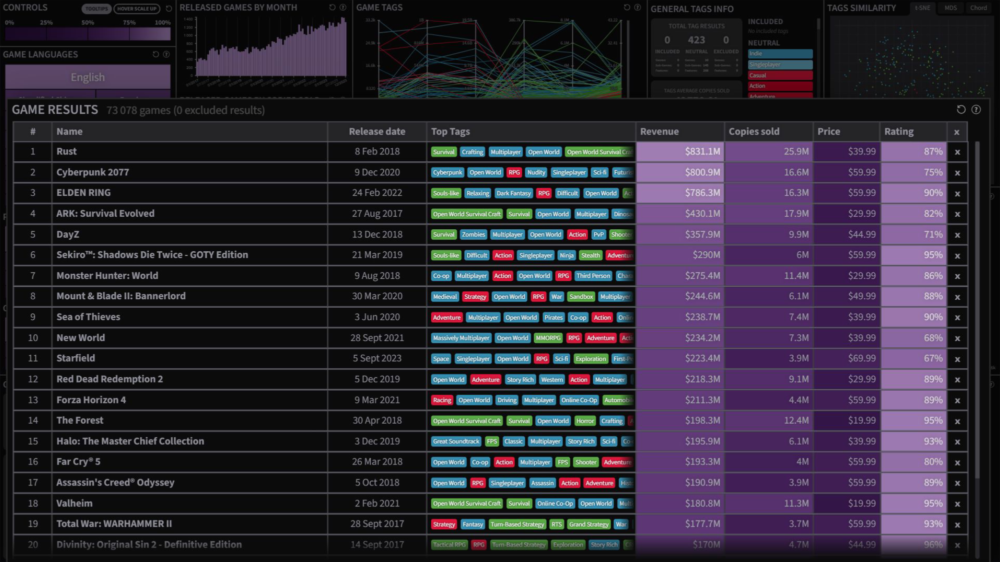
	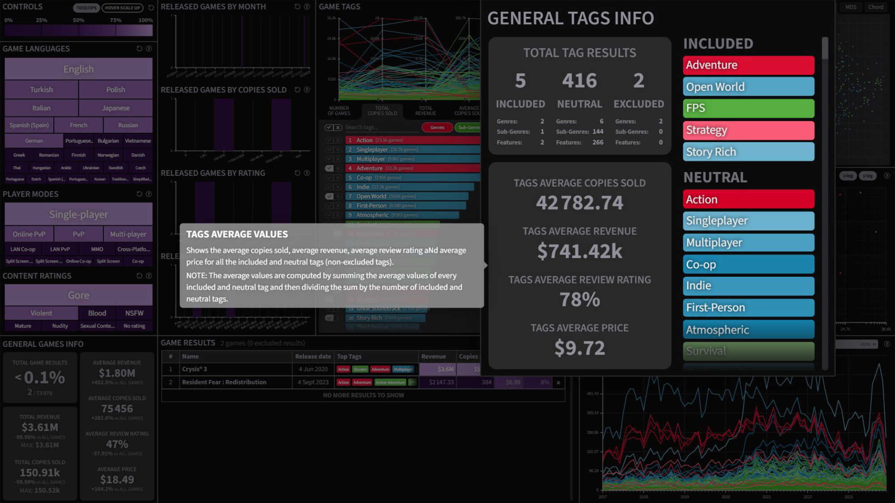
	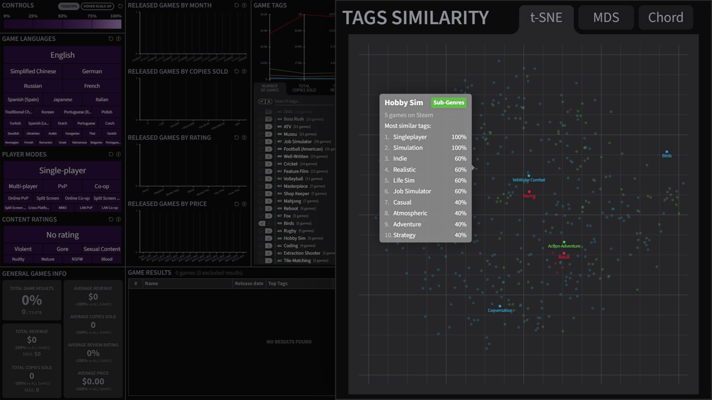
	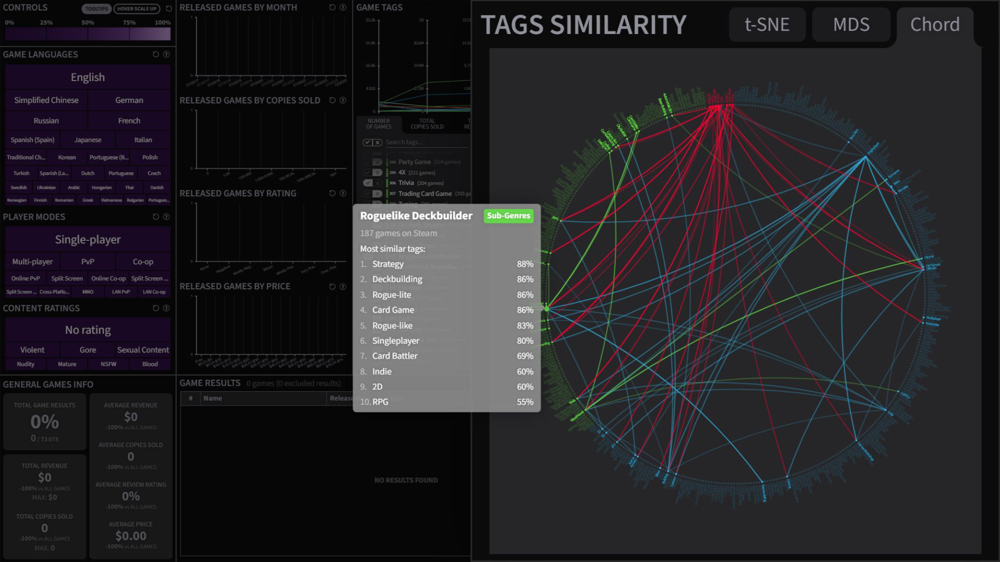
	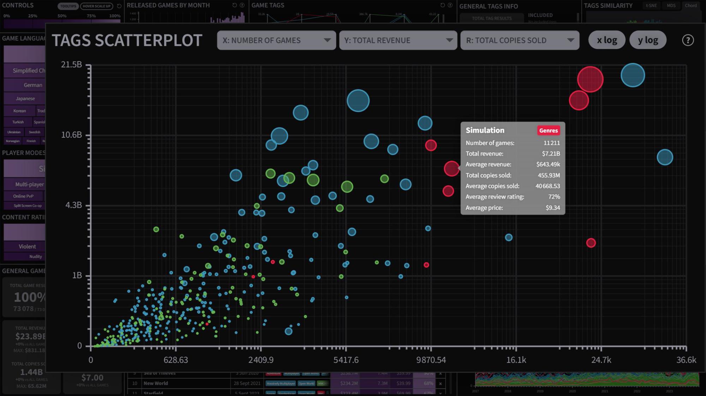
	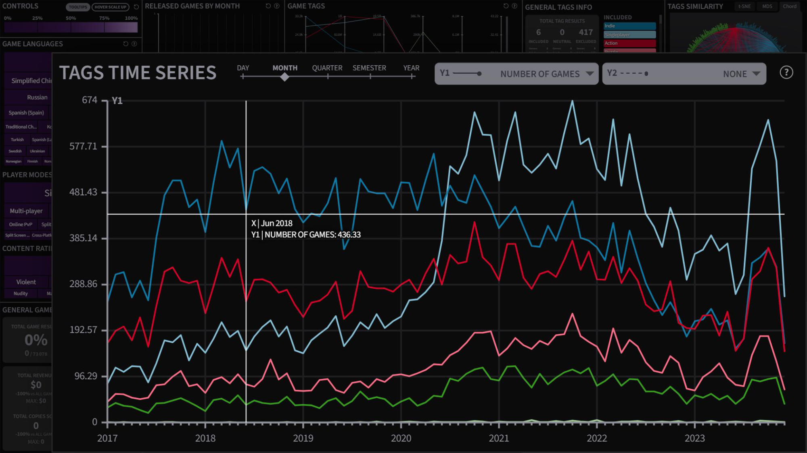

